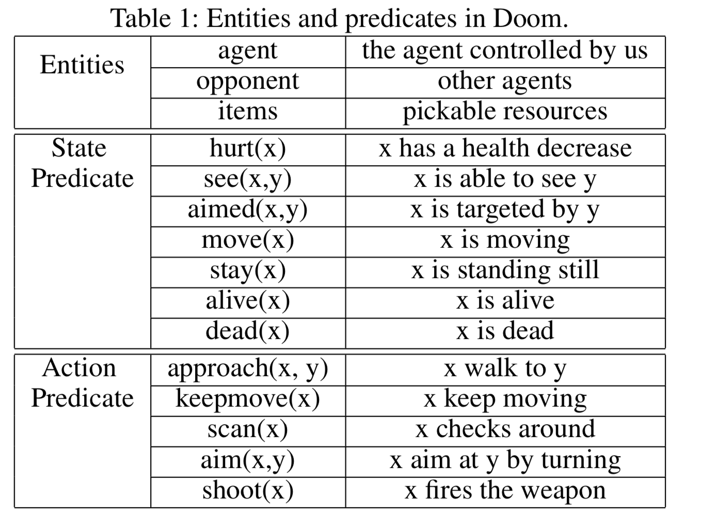
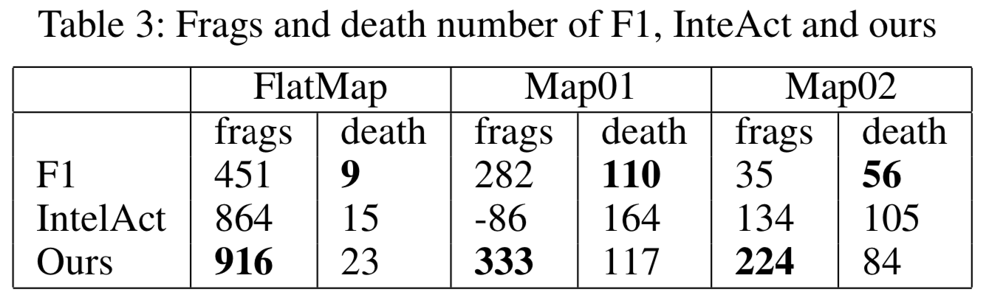

 # Learning to Assign Credit in Reinforcement Learning by Incorporating Abstract Relations

物体検知や位置推定などを挟んで、状態の次元を圧縮することで、探索コストを下げた手法。
現実に近いタスクはこの問題に悩まされがちなので、読んでみました。
適用環境はゲームに関する深層強化学習だけなので業務に完全に使うのは難しそう。

# Abstract
- Credit assignment problem(貢献度配分問題)は強化学習では非常に重要な問題である。
- 貢献度配分問題：
    - 報酬を獲得した場合、報酬の獲得にどの行動が効いたのかはエージェントにはわからない。
-   この問題は決定過程が幾千もの行動に関わってくる現実に近い環境ほど影響が強くなる。
- そこで、状態-行動間の貢献度を分配する計算過程を効率化することで、学習速度を向上させる。
-   具体的には、はじめに元の問題の状態と行動をより抽象化させることで、コンパクトな表現にする。これによって、元の問題を扱いやすいサイズにする。
-   そのあと、抽象化した問題に対して最適な価値関数を学習し、未来の価値を予測する。
-   最終的には、抽出した価値関数から、貢献度をを元の状態-行動ペアに割り当てる。
-   実験ではDoom環境に適用し、結果として、過去のエージェントに対してスコアに大きく差をつけた。
- エージェント同士を戦わせるコンペにも出場し、2位を獲得

# Introduction
- 貢献度分配問題は強化学習においてもっとも重大な挑戦である
- 一般的な環境では最終的な報酬は膨大な数の行動に依存しているため、この問題は非常に難しい。
- ほとんどの手法が、設定した期間の間の報酬を伝搬させることで無理矢理解決している。
- Atari2600のMontezma Revengeがいい例で、エージェントはマップ内の鍵を集めて扉を開ける必要があるのだが、そのためには、鍵がある画面にすべて貢献度を割り当てなければ行けないため、非常に実現性が低い。

- Reward shapingなどはエキスパート知識を組み合わせることで報酬関数に補正を加えて、この問題を解決している。
    - しかし、エキスパート知識は概念であり、関数として扱うには難しい。
- この問題を解決するため、貢献度分配問題のフレームワークを提案する。
- 元の問題を抽象的な形に圧縮し、最適な価値関数を算出したあとに、元の問題の貢献度分配問題に適用していきます。
- この方法によって、何十万もの状態-行動のペアの貢献度を自動的に割り当てることができる。  

- 提案手法は3つの段階に分割される。Abstraction, Planning, Feedbackの3つである。
    - Abstractionフェーズでは、First-Order-Logic(一階述語論理)を使って、オリジナルの問題の状態をfirst-order-logic 命題(リレーショナル状態 )に抽象化する。複数のオリジナル状態は1つのリレーショナル状態にマッピングされるため、リレーショナル状態の数はオリジナル状態の数よりはるかに小さくなる。
    - 計画フェーズでは、価値反復法で、各リレーショナル状態に対して、最適な価値関数を学習する。
    - 前のフェーズで得られた最適な価値関数はオリジナル状態の価値関数ではない。そのため、potential関数を使うことでオリジナルの価値関数に補正を加える。これはreward shapingにも使われている手法である。

- 実験の環境としてFPSゲームのDoomを採用した。
- オリジナルの報酬関数は敵を倒すことであるが、エージェントは複雑なマップ内を索敵し敵と戦闘し勝利してようやく得られる報酬であるため、報酬は疎であり、かつ遅れて得ることになる。  

- 構成要素ごとの比較、過去に発表されたエージェントとの対戦、実際に開催されたコンペティションのランキングを評価実験として示す。
- 貢献度分配の方法をいくつかのカテゴリに分類し、各方法のパフォーマンスを比較しました。
- 対戦では、過去に実装されたエージェントと戦わせた。その結果、キル数、デス数共に過去エージェントを上回った。
- 最後にDoom AI コンペティションに出場した結果、1位のエージェントと僅差の結果を獲得した。

# Related Work

## Deep Reinforcement Learning
-   ゲームを対象としたDRL研究が盛んに行われている。
-   エージェントは目的の状態に到達するために適切な行動を学習する。
-   代表的な成果といえば、3Dゲームを対象としたチャレンジであり、 Deep Recurrent Q-learningやカリキュラム学習が有名。
-   にも関わらず、いくつものチャレンジが計算量の都合上、残っている

## Relational Reinforcement Learning
-   Relational Reinforcement Learningは強化学習と Relational Learningを組み合わせたもので、状態、行動、Q関数を表現力の高い言語で示していることから内部が構造的なタスクに効果的である。
-   ZambaldiらによるDRRLはエンティティ間の関係を推論するためにself-attensionを使用して、モデルに依存しないポリシーを学習した。
-   本稿では、RRLの技術を導入し、よりコンパクトな問題の表現を試みる。

# Method
- Markov decision Processを前提におく。
- MDP: 状態遷移が確率的に生じる動的システムの環境モデル
  - $S$：取りうる状態集合
  - $A$：取りうる行動集合
  - $T$：状態間の遷移関数
  - $R$：報酬関数
  - $\lambda$：過去の報酬の割引係数
- 既存手法の代表としてQ学習を例に説明していく。
- Q学習とは各状態$s$と各行動$a$に対して行動価値関数$Q(s,a)$を定め、エージェントは$Q$関数を学習することで、最適な行動を学習する事になる。
- 状態価値$Q(s,a)$の更新式
$$
Q(s,a)\leftarrow Q(s,a)+\alpha[R(s,a,s\prime)+\lambda \max_{\alpha^\prime}Q(s^\prime, a^\prime) - Q(s,a)]
$$
- $\alpha$は学習係数、$R(s,a,s^\prime)$は状態$s$から行動$a$によって次の状態$s^\prime$に遷移した時の報酬、$\lambda \max_{\alpha^\prime}Q(s^\prime, a^\prime)$は次の状態の行動価値関数$Q(s^\prime,a^\prime)$の全ての行動に対する最大値である。
- 要するに、未来に獲得できるであろう報酬を学習して行動価値関数$Q$に反映させている。
- 既存の現実のシナリオをQ学習で解こうとすると、報酬をもらえる頻度が少ない場合に学習がうまくいかないことがある。
  - 例えば、チェスの勝敗や迷路の脱出、FPSだと敵を倒すまでに時間がかかる。
- その場合、既存手法ではもらった報酬を長い間伝搬させる必要があるため、収束が遅れてしまうことがある。
- そこで新たにRelational Markov Decision Process (以下RMDP)を導入することで、その問題を緩和させる。
- RMDPはMDPにおける状態、行動を抽象化することで、より小さい問題に落とし込むことを目的としている。
- RMDPを通した学習により、元の報酬に補正を加えることが本手法のキモである。
- RMDP: 
  - $<S_r, A_r, T_r, R_r, \lambda_r>$
  - $S_r$: MDPの状態$S$を抽象化させた状態、一階述語論理で表す
  - $A_r$: MDPではボタン操作が$A$に
  - $T_r$: $S_r$の状態遷移行列、手作業で定義していくらしい
  - $R_r$: 状態遷移の時の報酬関数、手作業で定義していくらしい
- RMDPの主なアドバンテージはMDPでは複雑だった状態を抽象化させることで数を少なくすることである。
- これにより、エキスパート知識を使って報酬関数を設計するのが簡単になったりする。
- その分状態遷移も定義し直さなければいけないと思う。

## Abstraction
- 元の状態を入力として、一階述語論理に変換して出力する。
- 数式としては次のように表す。

$S_r = f_s(S)$

- $S_r$では必要な情報のみを保存する。
- 例えば画像に関するタスクの場合、背景情報を削除することで前景の情報のみを保存する。
- この段階では複数の状態を1つの状態として表すので、状態数の削減が期待できる。

- この実装は元のタスクの入力形式や保持したい情報の種類によって異なる。
- シンプルなグリッドゲームの場合はルールベースの変換で十分だが、視覚情報を使うタスクでは、物体検知やImage segmentationなどが有効である。

- 抽象化の例
	1. 入力の画像: 箱の上にリンゴが乗っかっている。
	2. 物体検知でリンゴと箱の位置をそれぞれ推定。
	3. 座標位置から$on(apple, box)$をRMDPの状態として変換。
	4. 行動として予め定義していた述語($move(x,y)$など)を各行動にマッピングする。

## Planning
- もしRMDPのパラメータ$S_r,A_r,T_r,R_r$が全てわかっているなら、強化学習の問題は計画問題と等価であるので簡単に解ける。
- 
- この段階では、RMDPのパラメータである$T_r, R_r$を定義して、価値反復法で最適価値関数を学習する。
- RDMPでの報酬関数$R_r$はMDPでの報酬関数の部分集合となる。MDPにおける全ての非ゼロの状態-行動のペアはRMDPでも保持される。
- このように変換したRMDPを、価値反復アルゴリズムによって解き、最適な価値関数を獲得する。

## Feedback

# Application
- Doomを対象にして実験を行う。
- Doomを選んだ理由：
	- 貢献度分配問題の影響を非常に受けやすいゲームであるためである。
	- オリジナルの報酬は敵を倒すことで得られるため、報酬を得られる頻度がとても少ない。
	- そのことから、どの行動が報酬に効くのかの判定がとても重要になってくる。

## Architecture
- Doomにおける提案手法とA3Cを組み合わせたフレームワークが↓

- 提案手法はDRLアルゴリズムに依存しないため今回はDoom上で実績があるA3Cを採用している。
- 画面下
  - 既存手法のA3Cを用いている。
  - 環境から得られた画像を方策関数と価値関数に与えることで最適な行動を予測している。
  - 普通なら、環境からもらった報酬も使うところだが、提案手法を通して一度加工したものを使っている。
- 画像上
    - 提案手法の抽象化と論理演算の実装を示している。
    - 抽象化には、物体検知と場所検知を行い、ゲーム内のオブジェクトのbounding boxとオブジェクト間の位置情報を予測してい る。
    - 抽出されたオブジェクトの情報は、予め定義された述語に渡され、次の状態が決まる。
    - RMDPのパラメータは全て決まっているため、オフラインの計画アルゴリズムで最適価値は導き出される。
    - オリジナルの報酬と組み合わせることで、報酬を加工して、学習に利用している。

## Abstraction
- 物体検知と場所検知を行って状態を一階述語論理に落とし込んでいる。
- 抽象化させた例は↓

## Definition of the Relational MDP

# Evaluation
- 2つの評価値からフレームワークを評価する。
  - frag: 敵を倒した数ー自滅してした数
    - (ゲームではロケットランチャーなど爆発する武器を使うこともあるので自滅することもありうる)
  - Death: 敵に倒された数

- 実験の条件:
  - バッチサイズ: 128
  - 割引報酬係数$\lambda=0.99$
  - 学習係数 $\alpha = 10^{-4}$

## Ablation Study
- このゲームは敵をできるだけ多く倒すことが目的であるため、敵を倒した直前の射撃行動にだけ報酬を割り当て、そのほかの行動は0にする。
- この実験ではフレームワークをAttack, Defenceという2つのカテゴリに分けることで、この手法は何に効くのかを調査する。
- Attack :視界に敵が存在していたら、エージェントは直ちに発砲。複数の敵がいたら、最も近い敵を攻撃
- Defence: 敵がエージェントを狙っていたら、直ちに逃げて、弾を避ける。
- 

# Comparing with Known Opponents
- 前の大会のチャンピオンbotであるF1とIntel Actを比較対象として実験する。
- Flat Map, Map01, Map02上で弱いbot15人と個人戦を行う。
-  Flat Map: 正方形位の小さい部屋で撃ち合う。武器はピストルのみ。
-  Map01: 少し広めの部屋で戦う。武器はロケットランチャーなどのみ。
-  Map02: 広い部屋で戦う。多様な武器が落ちている。
- 結果が以下の表

- F1はMap01に過学習するように学習している
- Intel Actは強い武器を拾えるように学習しているため Map02に強い
- 提案モデルは地形や武器に依存しないため、汎用的な能力を持っている。
- F1はデス数は低いが、それは避ける傾向があるためである。
