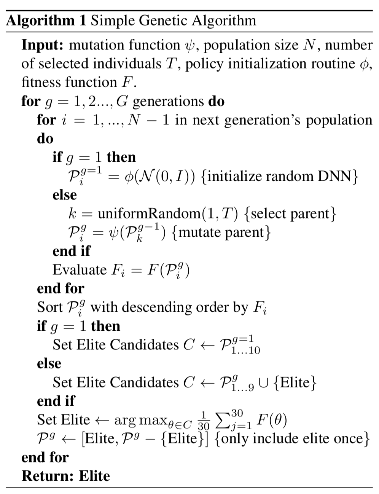
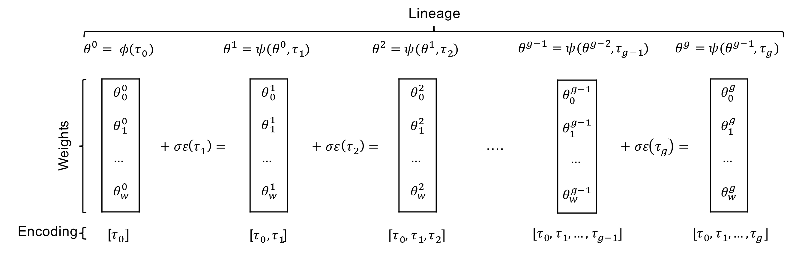
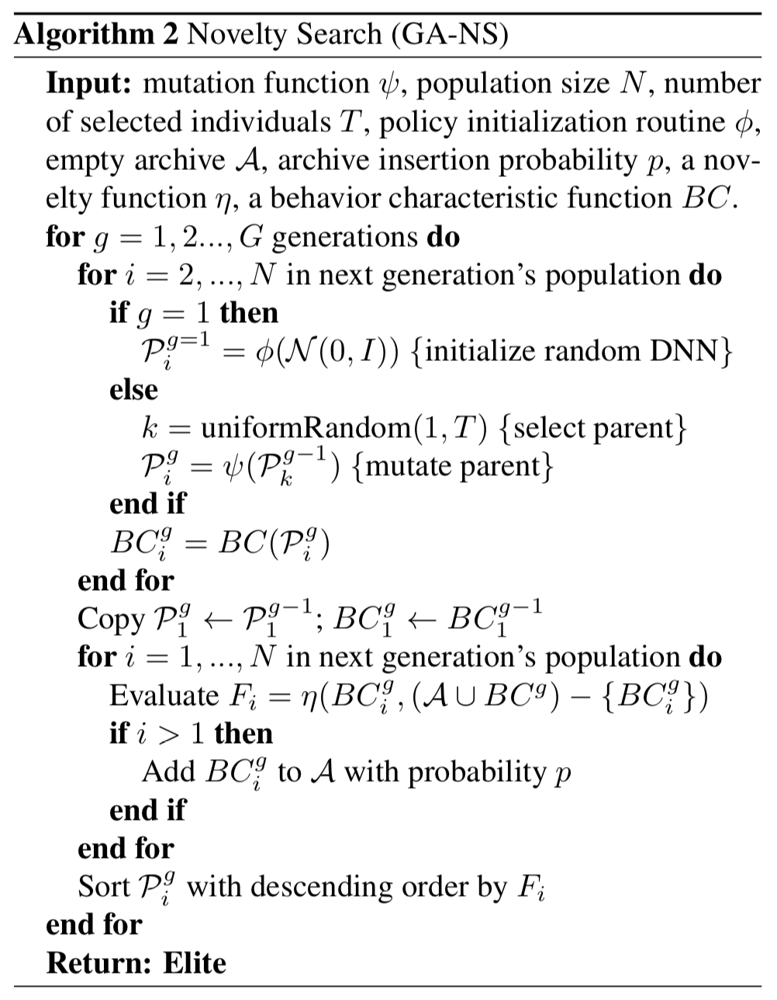
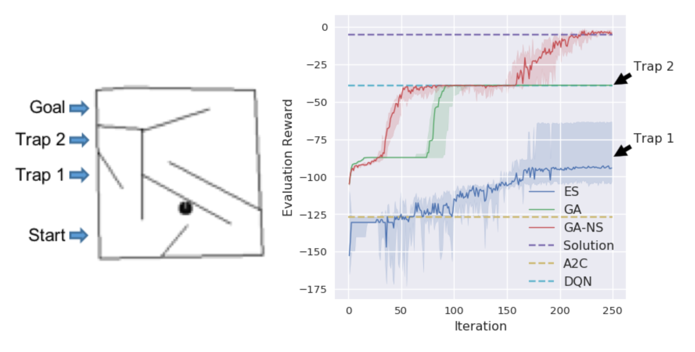

# Introduction

シンプルな遺伝的アルゴリズム(以下 GA)をDeep Reinforcement Learningに適用してみた。
DQNとA3Cと比較したところ、環境によってはそれらの手法を超えるケースがあった。

実験対象:
* Atari2600: 2Dアクションゲーム群の総称
* Humanoid Locomotion: 二足歩行シミュレータ

比較対象:
* Deep Q Network
* Asyncronous Advantage Actor-Critic

いくつかの環境で比較対象を上回ることに成功
ランダムサーチよりもパフォーマンスがよくなることを示す。
このことは、局所最適、鞍点、勾配のノイズなどが関係していると思われる。

# Background
DQNなどの価値反復法やA3Cなどの方策勾配法による深層強化学習の発展の中、Salimanらによって、Evolution Strategyアルゴリズム(以下 ES)を用いた手法も提案されている。このESアルゴリズムはパラメータの分布の平均は学習できるものの、分散までは学習できなかった。とはいえ、適切に複数のCPUを用いた並列化処理を行うことで、wall-clock上では少ない時間で学習はできている。

DNNの勾配を近似または演算し確率的に最適化をしていることから、DQNとA3Cは勾配ベースの手法である
それに対してESは解析的に勾配を算出することはなく、代わりに報酬関数の勾配を近似する。

この論文では勾配を使わないGAを実装し、RLの問題にどこまで効くのかをテストする。

# Methods

## Generic Algorithm
この実験ではシンプルな遺伝的アルゴリズムをベースラインとして実装し、次節で既存のテクニックを導入し、パフォーマンス向上を確認する。今後、さらにシンプルなGAに改良を加えることで、さらなる性能向上が期待できる。

遺伝的アルゴリズムは$N$個の個体を持つ集団$P$を進化させるアルゴリズムである。ここでは個体をNNのパラメータ$\theta$と考える。
各generationにおいて、$\theta_i$は適応関数$F(\theta_i)$が向上するように進化してゆく。

適応値が高い上位$T$個の個体を選び次の世代の親とする。

遺伝的アルゴリズムは次の操作を進化として$G$回繰り返す。
1. 次の世代を生み出すため、次のプロセスを$N-1$回繰り返す。
    1. 前の世代から選ばれた親はランダムに選択されgausiannノイズによって変異する。
2. $N$番目の個体は変異せず、前の世代でのベストな個体を採用。
3. 変異した個体の中で$F(\theta)$が高い個体$T$個を次世代の親とする。

擬似コード

ソースコード：https://github.com/uber-research/deep-neuroevolution

GAは通常、各個体であるNNのパラメータ$\theta$を保存しておくのが普通だが、非常にメモリを食うため、単純な実装は無理。
そこで、パラメータの圧縮方法を提案する。
初期シードと各変異のランダムシードを保存しておくことで、再現できるようにしている。
この圧縮した表現は世代に対して線形に増加していくだけなのでリーズナブルかつネットワークのサイズに依存しない。ただしDNNの再構築には計算時間がかかる。

以下が概要図

パラメータの初期化関数$\phi$とネットワークの変異関数$\psi$はどちらもシード値$\tau$で決定するため、シード値だけを保持しておけば、全世代の個体を再構成することが可能。

ネットワークの圧縮ではSOTA並みの成果を得られたが残念ながらGA以外に適用するのは困難。

## Novelty Search
前節のシンプルなGAを、前提案された手法を用いて改良する。
この論文ではNovelty Searchを適用する。NSは報酬ベースで最適化をしようとすると、局所最適に陥るような意地悪なドメイン向けに設計されている。
NSは進化中は報酬を無視し、代わりに未知の動作に遭遇したら報酬を与える。報酬を利用するアルゴリズムより良いスコアを出しやすい。

前説の遺伝的アルゴリズムとの差分は以下の通り。
* 方策によって決まる振る舞い特性(Behavor Characteristic)$BC(\pi(\theta))$を定義する。
* 適応関数$F(\theta_i)$は、BCの距離関数$dist(BC(\pi_i, \pi_j))$に変更。
* 距離関数はドメインによって異なる。

以下が擬似コード

# Experiments

## Atari
---
提案手法とDQN、A3C、SalmanのESを適用してパフォーマンスを比較する。
厳密な比較のため、エージェントが経験できるフレーム数を2億あるいは10億に制限。
同じフレーム数学習させたエージェント同士を比較する。

各アルゴリズムの実験結果はこちら

結果としては13のゲーム中、3つのゲームで既存手法を超えるスコアを獲得した。

それだけではなく、学習時間の少なさにも注目してほしい。
DQNやA3Cと比べてはるかに短時間で学習できている。
これは集団内の個体の数を多くして、代わりに進化回数を少なくしていることが効いていると考えられる。
実験では、学習序盤でDQNを超えるという結果が多かった。

RS versus QhDQN, A3C and ESの実験結果から、多くのAtariは意外と簡単なのかもしれない。
最適な方法は勾配による方法ではなく、その時々の最近傍の探索を行った方が良い場合もあることを示唆している。

#### 予備実験: ランダムサーチアルゴリズムとの関係
遺伝的アルゴリズムでは、各世代ごとに少しの分散をパラメータベクトルに適用している。
そして、数世代のうちにDQNやA3Cを超えるスコアを見せていることから、高品質な方策関数は初期状態に含まれているのではないか。
そこから、遺伝的アルゴリズムはただのランダムサーチをしている訳ではないのかという疑問が出てくる。

この問いに応えるため、各ゲームにランダムサーチアルゴリズムを適用し、ベストスコアを調べてみた。
遺伝的アルゴリズムの方が良い結果を出していた。

いくつかのゲームにおいてA3CやDQNの方がRSより悪い結果を出していたのも興味深い。
実際、RSによって作られたポリシーは洗練された動きを見せることがあった。
Frostbiteを例に見るといい感じにプレイできていた。
この結果からランダムサーチは特定の環境にオーバーフィットするループの流れを見つけたのかもしれない。
ランダムサーチによって学習したエージェントは実際に他の初期状態にも一般化されており、200の異なるシード値の環境で実験しても高いスコアを獲得している。

多くのAtariは意外と簡単なのかもしれない。
最適な方法は勾配による方法ではなく、最近傍の探索を行った方が良い場合もあるのではないだろうか。

## Image Hard Maze
---
GA-NSの効果を確認するためImage Hard Maze問題にも適用
Image HardMazeは目標に近づくほど報酬がもらえる。そのため、貪欲に移動するとトラップに陥るためそこから動けなくなる。
NSは未知の状態を優先するため、この問題に向いている。

この問題は俯瞰で迷路の画像を入力する。
この問題は観測情報に全ての情報が含まれているため、簡単ではあるが、高次元の資格情報である点に関しては難易度は向上している。

この問題にもDQNとA2Cを適用したがGA-NSが最良の結果を出していた。
NSはオリジナルの報酬を無視して、未知の状態を優先するため、トラップに陥ることは少ない。

## Humanoid Locomotion
うまくいかなかったようだ

# Discussion
高密度サンプリングは環境によっては勾配ベースのメソッドよりも良いパフォーマンスを発揮することがある。
理由としては、局所最適解が存在する場合勾配ベースより遺伝的アルゴリズムの方がよい。
GAではパラメータ空間上で局所最適を飛び越えることができるため。
1つの提案としては最初はgradient-freeを用いて、後半は勾配ベースに切り替えるのが良いのかもしれない。

強化学習においてGAとその他のアルゴリズムとの比較はまだほとんどできていない。
加えてまだ、ナイーブなGAで実験しただけなので今後、GAの改善も必要だ。

# 読んでみて

* スコアはともかく、短時間でそれなりに行動できるエージェントができるのはすごいと思った。
* A3Cとの組み合わせる方針は試してみたいところではある。
* 適応関数の実装は気になるところではある。
* アルゴリズムの改良余地がまだまだあるのでウォッチしておこう。
* おそらく適切な並列処理を組まなければいけない気がするため実装は大変かもしれない(要調査)