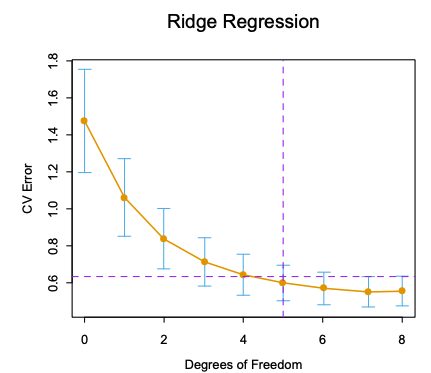

# 3.4 縮小推定
今までの変数選択 : 変数を保持するか除外するかの2値での処理

→ 分散が大きくなることが多いため全変数モデルの予測誤差を減らせることは難しい

→縮小推定:
連続的に変数を除外することで、この問題を解決
## 3.4.1 リッジ回帰
回帰係数の大きさに罰則を課すことで係数の値を縮小させる。

$$
\hat{\beta}^{ridge} = \argmin_{\beta}\{\displaystyle \sum^{N}_{i=1}(y_i-\beta_0- \displaystyle \sum^{p}_{j=1}x_{ij}\beta_i)^2 + \lambda\sum^p_{j=1}\beta_j^2\}
$$

最適な係数$\hat{\beta}^{ridge}$は罰則付き残差二乗和の最小化により求められる。
$\lambda$は複雑度パラメータであり、大きくなると縮小度合いも大きくなる。全ての係数は0に向かって縮小されるため、荷重減衰と言われる。
この式では切片$\beta_0$は罰則の項に含んでいない。これは変数選択が Yの原点の選び方に依存してしまうことを防ぐためである。

別な表現でのリッジ回帰が↓

$$
\hat{\beta}^{ridge} = \argmin_{\beta}\{\displaystyle \sum^{N}_{i=1}(y_i-\beta_0- \displaystyle \sum^p_{j=1}x_{ij}\beta_i)^2 \} \\

\text{subject to } \sum^p_{j=1}\beta_j^2\leq t
$$

既存の残差二乗和の最小化に制約を追加した。
この制約条件がなかった場合、係数の推定は不安定になりうる。例えば、変数は不当に大きくなり別な変数は負の方向に大きくなることもありうる。

リッジ回帰の解は入力変数の大きさに対して不変ではないため、入力変数を標準化しておく必要がある。
そこで$x_{ij}$を$x_{ij}-\bar{x}$で中心化する。
加えて切片$^\beta_0$は$\bar{y}=\frac{1}{N}\sum^N y_i$から求めることで、切片を無視した係数を求めることができる。

ここからは$\bf X$の平均0かつ$\beta_0=0$という前提で話を進める。

入力の行列$\bf X$と目標のベクトル$\bf y$を元に上の式の規準を行列形式で表す。

$$
(\bf y - \bf X \beta)^T(\bf y - \bf X \beta)+\lambda\beta^T\beta
$$

この時リッジ回帰の解は次のように求められる

 $$
 \hat{\beta}^{ridge} = (\bf X^T{\bf X}+\lambda\bf I)^{-1}\bf {X}^T{\bf y}
 $$

$N \times p$の行列$\bf X$に対して特異値分解を行うことで、リッジ回帰の特性の知見を得る。

$$\bf X=\bf U\bf D{\bf V}^T$$

$U$の列ベクトルは$X$の列空間を張り、$V$の列ベクトルは$X$の行空間を張る。$D$は対角行列であり対角成分は$d_1\geq d_2 \geq \cdots \geq d_p \geq 0$。
$d_j$ は$\bf X$の特異値と呼ばれる。 

特異値分解を用いたリッジ回帰の解は以下の通り

$$
\bf X  \hat{\beta}^{ridge} = {\bf X}(\bf X^T{\bf X}+\lambda\bf I)^{-1}\bf {X}^T{\bf y} \\

= {\bf U}{\bf D}({\bf D}^2+\lambda{\bf I})^{-1}{\bf D}{\bf U}^T{\bf y} \\

= \sum^p_{j=1}{{\bf u}_j\frac{d_j^2}{d_j^2 + \lambda}{\bf u}_j^T{\bf y}}
$$

このとき、${d_j^2}/{d_j^2 + \lambda}\leq 1$であるため、$d_j^2$の値が小さくなるにつれ、対応する次元の成分は縮小されることを意味している。

$\bf X$の特異値$d_j^2$は$\bf X$の変数の主成分とも関係がある。
$X$の不偏共分散行列$\bf S = {\bf X}{\bf X}^T/N$で与えられ、特異値分解の式を代入すると次のようになる。

$$
{\bf X}{\bf X}^T={\bf V}{\bf D}^2{\bf V}^T
$$
これは${\bf X}{\bf X}^T$の固有値分解と見ることができ、$\bf V$の列ベクトル$v_j$を$\bf X$の主成分と呼ぶ。
$\bf X$の第1主成分方向$\bf X v_1$は、最も大きい分散を持つ、分散は以下のように求められる。

$$
Var(\bf X v_1)=\frac{d^2_1}{N}
$$

それに対して、最後の主成分は最小の分散を持つことになる。つまり、リッジ回帰は小さい分散を持つ成分を最も縮小させる。
応答変数は入力の分散が大きい方向に最も変化しやすいことが多いため、リッジ回帰はそのような場合に有効であると考えられる。

推定予測誤差と変数の有効自由度$df(\lambda)$の関係を図3.7に示す。

$$
df(\lambda) = \sum^p_{j=1}{\frac{d_j^2}{d_j^2 + \lambda}}
$$

$\lambda$を増加させることにより、推定予測誤差の減少が期待できる。
図3.7では$df(\lambda)=5.0$(←7.0では？)の時に推定予測誤差が最小になる。