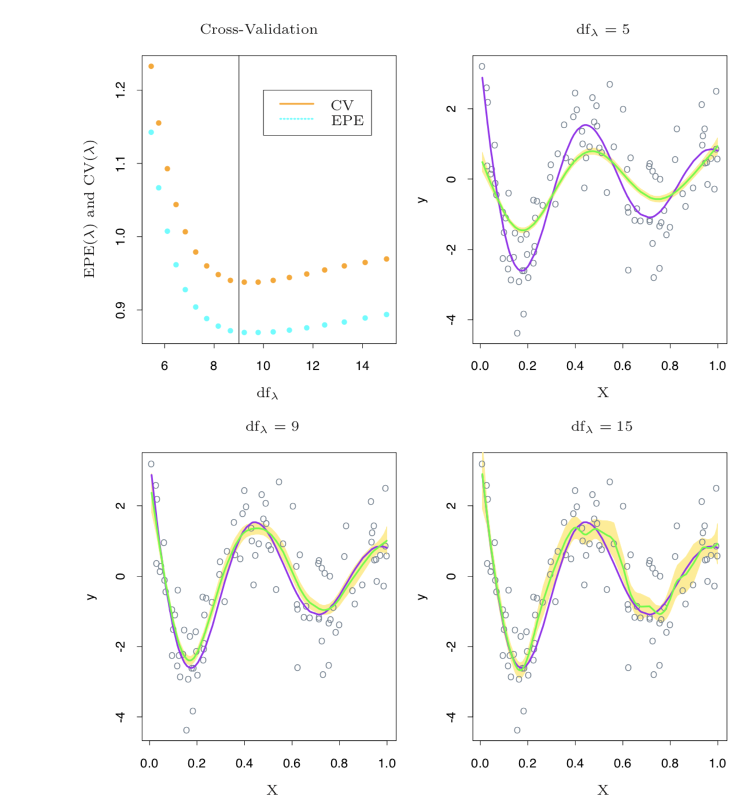
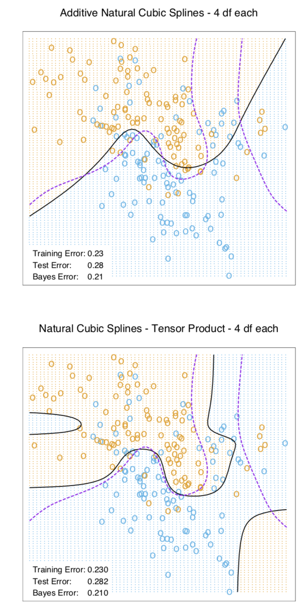
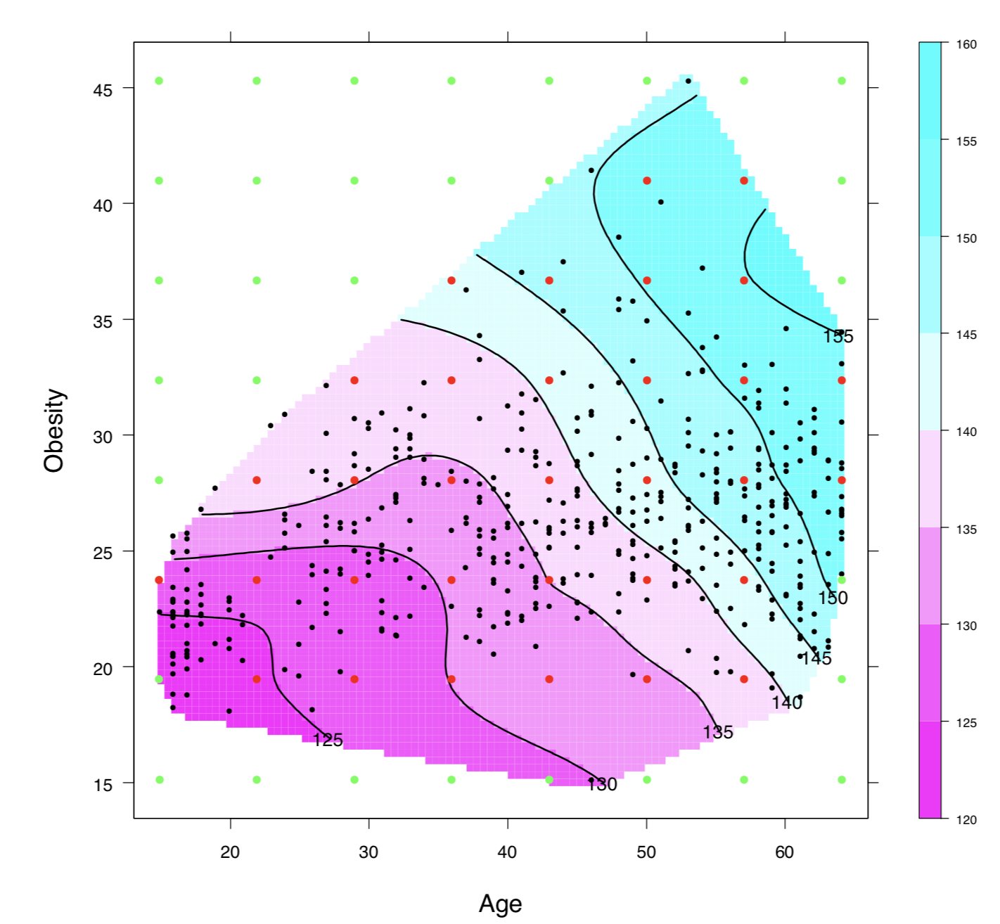

## 前回のあらすじ(再掲)

入力 $X$ を $X$ の変換により得られる新たな変数で補ったり、それらに置き換えたりすることで得られる新しい特徴空間において線形モデルを用いる。

手法の1つとして区分区間法があり、スプライン関数を使うことで区間ごとに連続になるように入力を変換する。

具体的には、区間を分割し区間ごとにモデルを割り当てる。
→ 区間の境界(節点)を連続に表現 → 節点の2次導関数が連続的: 3次元自然スプライン

## 5.4 平滑化スプライン

区間で関数による当てはめを行ってきたが、この節ではその複雑性のコントロールについて考える。

区分多項式による当てはめを次の罰則付き誤差を最小化する問題と捉える。

$$
RSS(f, \lambda) = \sum^N_{i=1}\{ y_i - f(x_i)\}^2 + \lambda \int\{f{\prime\prime}(t)\}^2 dt
$$

$\lambda$: 平滑化パラメータ。
第1項はデータへの当てはめの良さ、第2項は関数の歪曲度に罰則を課す。

この上式の最小化問題を解くと予測関数$f$は3次元自然スプラインとなる。
(証明:[このスライドシェア](https://www.slideshare.net/KotaMori/556-65129868) のp35)

### 5.4.1 自由度と平滑化行列

平滑化スプラインでの係数$\lambda$の選択について考える。

選択方法を述べる前に、この項目では平滑化の程度を事前に見積もる直感的な方法について議論する。←全然直感的じゃない。。。

難しすぎたので、要約だけします。

3次元自然スプラインを基底関数($N_1, \cdots N_j$)で表すと、

$$
f = \sum^N_j = N_j\theta_j
$$
$\theta$は係数

この時、$\{\bf{N}\}_{ij} = N_j(x_i)$および$\{\bf{\Omega_N}\}_{jk} = \int N_j^{\prime\prime}(t)N_j^{\prime\prime}(t) dt$と置くと、最小化問題の式は行列形式で以下の通りに書き直せる。

$$
RSS = \min_\theta (\bf y - \bf N \theta)^T(\bf y - \bf N \theta) + \lambda\theta^T{\bf \Omega}^T_N \theta
$$

この最小化問題を$\bf{y}$について解くと、予測値$\bf{y} = \hat{\bf{f}} = \bf{S}_\lambda\bf{y}$となり、以下の性質が得られる。

1. $df_\lambda = trace(S_\lambda)$で自由度を定義する
2. $df_\lambda $は$\lambda$が大きくなるに連れて減少する。
3. $\lambda \rightarrow 0$の時、$df_\lambda \rightarrow N$
4. $\lambda \rightarrow \infty$の時、$df_\lambda \rightarrow 2$

## 5.5 平滑化パラメータの自動選択
回帰スプラインとは違い、平滑化スプラインではほとんどの場合3次元スプラインを用いるため、罰則パラメータ$\lambda$を求めるだけで良い。

### 5.5.1 固定自由度

自由度$df_\lambda=trace(S_\lambda)$は、$\lambda$に対して単調であるため、$df$を固定することで$\lambda$を導出できる。
この方法はRでも実装されており、いくつかの異なる$df$を試し、特定の指標に基づいてその1つを選択するといった方法が使われる。

### 5.5.2 バイアスと分散のトレードオフ

自由度$df_\lambda=\{5, 9, 15\}$で変化させて比べてみた。

紫の線は真の関数、緑の線は予測した関数、黄色の領域は標準誤差。

|$df_\lambda$  |  |
|---|---|
|5  |過小当てはめなスプライン。分散は小さいもの、曲率が大きい領域でバイアスが生じている|
|9  |わずかながらバイアスは生じているが、分散が小さく、適切に当てはめられている。  |
|15 |真の関数に近いものの、分散が大きく、曲率が大きい領域で激しく過剰適合している。|

バイアスと分散を結びつける指標として期待二乗予測誤差(EPE)が存在する。

$$
EPE(df_\lambda) = E(Y - \hat{f_\lambda})^2 = \sigma^2 + MSE(\hat{f_\lambda})
$$
$\hat{f_\lambda}$は予測したスプライン関数、$(X,Y)$は訓練点以外のデータ

図5.9の左上図に置ける青い点からは$df_\lambda=9$が適切であることがわかる。

$(X,Y)$の点を揃えるのには真の関数が必要なので、クロスバリデーションも評価とする。
以下がleave-one-out CVの公式。

$$
CV(df_\lambda) = \frac{1}{N}\sum^N_{i=1}(y_i - \hat{f_\lambda}^{(-i)}(x_i))^2 = \frac{1}{N}\sum^N_{i=1}\left(\frac{y_i - \hat{f_\lambda}(x_i)}{1-S_\lambda(i,i)}\right)^2
$$

$\hat{f_\lambda}^{(-i)}$は$i$番目のデータを除いたモデルを表す。1つだけデータを除いてテスト用データとしてモデルの評価に利用する。$CV$が小さくなるように$\lambda(df_\lambda)$を調整する。

$\bf S_\lambda$ の対角要素 $S_\lambda(i,i)$から計算できるのが美味しい。

## 5.6 ノンパラメトリックロジスティック回帰

平滑化スプラインでは回帰問題を前提にしている。ここでは分類問題に適したロジスティック回帰にもスポットを当てる。
問題となる式は以下の通り。

$$
\log{\frac{Pr(Y=1 | X=x)}{Pr(Y=0|X=x)} = f(x)} \\
Pr(Y=1 | X=x) = \frac{e^{f(x)}}{1+e^{f(x)}}
$$

ここで対数尤度によるルールが次の式で表される。

$$
l(f;\lambda) = \sum^N_{i=1}\left[y_i \log p(x_i) + (1-y_i)log(1-p(x_i)) \right] - \frac{1}{2} \lambda \int \{f^{\prime\prime}\}^2 dt \\
= \sum^N_{i=1} \left[ y_if(x_i)-\log (1+e^{f(x_i)}) \right] - \frac{1}{2} \lambda \int \{f^{\prime\prime}\}^2 dt
$$

ここで$p(x_i)=Pr(Y=1|x)$と略している。この式の第1項は、二項分布による対数尤度であり、第2項は$f$の歪曲度による罰則となる。

この式も最小問題として解くと$f$は有限次元自然スプラインとなる。

## 5.7 多次元スプライン
ここまで1次元のスプラインモデルに焦点を当ててきたが、多次元に拡張する。
二次元座標$X\in \mathbb{R}^2$  に対して、座標$X_1$の関数を表す$M_1$個の基底$ h_{1j}(X_1)$と座標$X_2$を表す$M_2$個の基底$h_{2k}$の集合が与えられているとする。

この時$M_1 \times M_2$次元のテンソル積基底は次の式で表される。
$$
g_{jk}(X) = h_{1j}(X_1)h_{2k}(X_2)
$$

この時、基底展開は全ての次元に対する和になる。

$$
g(X) = \sum_{j=1}^{M_1}\sum_{k=1}^{M_2}\theta_{jk}g_{jk}(X)
$$

これにより「変換して線形」で表現できたので、好きに当てはめができる。ただし、基底の次元は指数的に増えるため、次元の呪いに注意。

多次元スプラインの効果を実験する。

図5.11について、上の図は2つの座標おのおので自然スプラインを用いた場合の加法的ロジスティック回帰の決定境界を示している。
下の図は各座標において、テンソル積基底を用いた場合の結果を示している。
紫の破線はこの問題のベイズ決定境界である。

より柔軟な決定境界を決められるが、その他の部分で間違った構造を導いてしまっている。

1次元平滑化スプラインについても同様に、正則化を通してより高次元に一般化できる。
$x_i \in \mathbb{R}^2$である組み$y_i, x_i$(この書き方だと1次元に見える。。。)が与えられた時、$d$次元回帰関数$f(x)$を求めたいとする。
考え方としては問題を次の式のように定式化することである。

$$
\min_f \sum^N_{i=1}\{y_i - f(x_i)\}^2 + \lambda J[f]
$$

$J$は$\mathbb{R}^d$内で関数$f$を安定化させるための適切な罰則汎関数である。
2次元空間上での$J$はp189の式5.38となる。

この式の最適化により、薄板スプラインとして知られる滑らかな2次元の表面が得られる。この方法は5.4でやった平滑化スプラインと多くの共通点を持つ。
- $\lambda \rightarrow 0$の時、解は補間関数へと近づく。
- $\lambda \rightarrow \infty$の時、解は最小二乗表面へと近づく。
- その間の$\lambda$においては、係数が一般化リッジ回帰の形で得られる線形基底展開として表される。

最終的に解は次のようになる。
$$
f(x) = \beta_0 + \beta^Tx + \sum^N_{j=1}\alpha ||x-x_j||^2log||x-x_j||
$$

この解の計算には$\mathcal{O}(N^3)$かかるらしい。これは$N$個の節点を全て計算することが原因である。
工夫によっては大幅に少ない節点で済ませられる。実用的には領域をおおう接点の格子を用いることで普通は十分。
格子状の$K$節点を用いた場合、計算量は$\mathcal{O}(NK^2+K^3)$となる。

図5.12に計算量を削減した薄板スプラインを当てはめた結果を示す。

緑色と赤色の点が格子状に並べられており、赤点だけがスプラインの推定に使われているようだ。